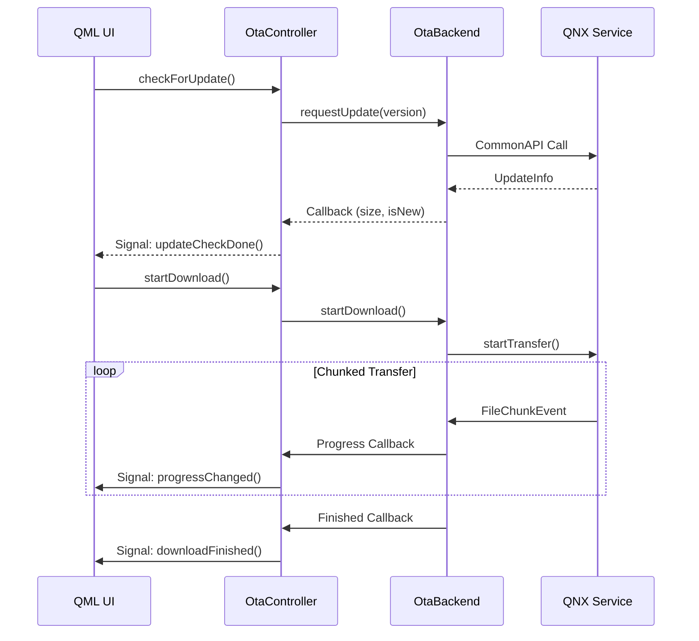

# QNX OTA Client GUI

<div align="center">

**Qt6-Based Monitoring & Control Interface for OTA Updates**

[](https://www.qt.io/)
[](https://isocpp.org/)
[](https://doc.qt.io/qt-6/qmlapplications.html)
[](https://covesa.github.io/capicxx-core-tools/)

[Features](#-features) • [Architecture](#-architecture) • [Installation](#-installation) • [Usage](#-usage) • [API Reference](#-api-reference)

</div>

---

## 📋 Overview

The **QNX OTA Client GUI** is a modern, real-time monitoring application built with Qt6 and QML that provides a visual interface for managing Over-The-Air software updates. The application connects to the QNX OTA Gateway via CommonAPI/SOME-IP and displays update status, system metrics, and download progress with a card-based UI design.

### Key Capabilities

- 🎯 **Real-Time Update Monitoring** - Live progress tracking with chunk-by-chunk visualization
- 📊 **System Metrics Dashboard** - CPU, memory, storage, temperature, and uptime monitoring
- 🔄 **State-Based UI** - Dynamic card system reflecting current OTA state
- 🌐 **Service Discovery** - Automatic connection to QNX OTA Gateway
- 📈 **Download Analytics** - Speed calculation and transfer statistics
- 🎨 **Modern Design** - Glassmorphism effects and smooth animations

---

## ✨ Features

### Update Management
- **Version Checking** - Query server for available updates
- **Download Control** - Start/pause update downloads
- **Progress Tracking** - Real-time percentage and chunk counters
- **Speed Monitoring** - Live MB/s transfer rate calculation
- **State Transitions** - Visual feedback for all OTA stages

### System Monitoring
| Metric | Description | Update Interval |
|--------|-------------|-----------------|
| **CPU Usage** | Percentage utilization (0-100%) | 1 second |
| **Memory** | Used/Total in MB | 1 second |
| **Storage** | Used/Total in GB | 1 second |
| **Temperature** | Device temperature in °C | 1 second |
| **Uptime** | System uptime (days/hours/minutes) | 1 second |

### UI States
The application uses a card-based system with 7 distinct states:

1. **Idle** - Initial state, ready to check for updates
2. **Checking** - Querying server for update availability
3. **Update Available** - New version detected, ready to download
4. **Up To Date** - Current version is latest
5. **Downloading** - Active file transfer with progress
6. **Download Finished** - Transfer complete, ready to apply
7. **Request Refused** - Server rejected download request

---

## 🏗 Architecture

### Component Overview

```
┌─────────────────────────────────────────────────────────┐
│                     QML Frontend                        │
│  ┌──────────────┐   ┌──────────────┐  ┌──────────────┐  │
│  │   Main.qml   │   │    Cards     │  │  Components  │  │
│  │  (Dashboard) │   │ (State Views)│  │  (Widgets)   │  │
│  └──────┬───────┘   └──────┬───────┘  └──────┬───────┘  │
└─────────┼──────────────────┼──────────────────┼─────────┘
          │                  │                  │
          └──────────────────┼──────────────────┘
                             │ Q_PROPERTY Bindings
          ┌──────────────────▼──────────────────┐
          │        OtaController (Qt/C++)       │
          │  • State Management                 │
          │  • Signal/Slot Coordination         │
          │  • Thread Safety (QMetaObject)      │
          └──────────────────┬──────────────────┘
                             │ Callbacks
          ┌──────────────────▼──────────────────┐
          │         OtaBackend (C++)            │
          │  • CommonAPI Proxy Management       │
          │  • SOME/IP Communication            │
          │  • Event Subscription               │
          │  • System Info Polling              │
          └──────────────────┬──────────────────┘
                             │ CommonAPI/SOME-IP
          ┌──────────────────▼──────────────────┐
          │        QNX OTA Gateway Server       │
          │  • Update File Management           │
          │  • Version Control                  │
          │  • Chunked Transfer Protocol        │
          └─────────────────────────────────────┘
```

### Data Flow



---
## 🎮 Usage

### Running the Application

```bash
# Set environment
export COMMONAPI_CONFIG=./commonapi.ini
export VSOMEIP_CONFIGURATION=./vsomeip.json
export VSOMEIP_APPLICATION_NAME=client-sample

# Run
./appqnxOta
```

### Application Workflow

#### Step 1: Initial Connection
```
┌─────────────────────────────────────┐
│  [Idle State]                       │
│                                     │
│  ○ Status: Checking server...       │
│  ○ Action: Waiting for connection   │
│                                     │
│  [Server Connected: ✓]              │
└─────────────────────────────────────┘
```

#### Step 2: Check for Updates
```
┌─────────────────────────────────────┐
│  [Idle State]                       │
│                                     │
│  ┌──────────────────────────────┐   │
│  │  [Check for Updates] Button  │   │
│  └──────────────────────────────┘   │
│                                     │
│  System: Current Version 1.5        │
└─────────────────────────────────────┘
```

#### Step 3: Update Available
```
┌─────────────────────────────────────┐
│  [Update Available]                 │
│                                     │
│  New Version: 2.0                   │
│  Size: 856.7 MB                     │
│                                     │
│  ┌──────────────────────────────┐   │
│  │  [Download Update] Button    │   │
│  └──────────────────────────────┘   │
└─────────────────────────────────────┘
```

#### Step 4: Download Progress
```
┌─────────────────────────────────────┐
│  [Downloading]                      │
│                                     │
│  Progress: 67%                      │
│  ███████████████░░░░░░░░            │
│                                     │
│  Speed: 12.4 MB/s                   │
│  Chunks: 856 / 1287                 │
│  Size: 856.7 MB                     │
└─────────────────────────────────────┘
```

#### Step 5: Download Complete
```
┌─────────────────────────────────────┐
│  [Download Finished]                │
│                                     │
│  ✓ Update downloaded successfully   │
│  ✓ Ready to apply                   │
│                                     │
│  File: rpi4-update.wic              │
│  Location: /data/client/            │
└─────────────────────────────────────┘
```

---

## 📂 Project Structure

```
GUI/
├── assets/                          # UI Resources
│   ├── blackberry.png              # BlackBerry QNX logo
│   ├── checkmark.png               # Success indicator
│   ├── cpu.png                     # CPU icon
│   ├── download.png                # Download icon
│   ├── error.png                   # Error indicator
│   ├── ethernet.png                # Network icon
│   ├── memory-card.png             # Storage icon
│   ├── ram.png                     # Memory icon
│   ├── server.png                  # Server status icon
│   ├── shield.png                  # Security icon
│   └── temp.png                    # Temperature icon
│
├── backend/                         # CommonAPI Integration Layer
│   ├── CMakeLists.txt
│   ├── src/
│   │   ├── OtaBackend.cpp          # CommonAPI proxy wrapper
│   │   └── OtaBackend.h
│   └── src-gen/                    # Generated CommonAPI Code
│       ├── core/v0/filetransfer/example/
│       │   ├── FileTransfer.hpp
│       │   ├── FileTransferProxy.hpp
│       │   ├── FileTransferProxyBase.hpp
│       │   ├── FileTransferStub.hpp
│       │   └── FileTransferStubDefault.hpp
│       └── someip/v0/filetransfer/example/
│           ├── FileTransferSomeIPCatalog.json
│           ├── FileTransferSomeIPDeployment.cpp
│           ├── FileTransferSomeIPProxy.cpp
│           └── FileTransferSomeIPStubAdapter.cpp
│
├── cards/                           # State-Based UI Cards
│   ├── CardChecking.qml            # "Checking for updates" state
│   ├── CardDownloadFinished.qml    # Download complete state
│   ├── CardDownloading.qml         # Active download state
│   ├── CardIdle.qml                # Initial/idle state
│   ├── CardRequestRefused.qml      # Download rejected state
│   ├── CardUpdateAvailable.qml     # Update available state
│   └── CardUpToDate.qml            # No updates available state
│
├── components/                      # Reusable UI Components
│   ├── CardShadow.qml              # Drop shadow effect
│   ├── LogEntry.qml                # Log message widget
│   ├── MetricRow.qml               # System metric display
│   ├── OnlineStatusIndicator.qml   # Connection status LED
│   ├── PrimaryButton.qml           # Styled button component
│   └── StatusTile.qml              # Metric tile widget
│
├── data/client/                     # Downloaded Updates Storage
│   ├── update.version              # Current version file
│   └── *.wic                       # Downloaded image files
│
├── CMakeLists.txt                   # Qt6 + CommonAPI build config
├── commonapi.ini                    # CommonAPI configuration
├── vsomeip.json                     # SOME/IP network config
├── main.cpp                         # Application entry point
├── Main.qml                         # Root QML component
├── OtaController.h                  # Qt/C++ bridge controller
├── OtaController.cpp                # Controller implementation
└── README.md                        # This file
```

---

## 🔧 Configuration

### Platform Selection
Edit `OtaBackend.h` to set your platform:

```cpp
#define UBUNTU_PLATFORM 0  // Set to 1 for Ubuntu development
                           // Set to 0 for Raspberry Pi deployment

#if UBUNTU_PLATFORM == 1
    #define OTA_ROOT "/home/user/workspace/QT6_Projects/qnxOta/"
#else
    #define OTA_ROOT "/home/root/rpi-update-ota/"
#endif
```

### Network Configuration
Edit `vsomeip.json`:

```json
{
    "unicast": "YOUR_CLIENT_IP",
    "services": [
        {
            "service": "0x1234",
            "instance": "0x5678",
            "unreliable": "30509"
        }
    ],
    "routing": "client-sample",
    "service-discovery": {
        "enable": "true",
        "multicast": "224.224.224.245",
        "port": "30490",
        "protocol": "udp"
    }
}
```

### Version File Format
`update.version` should contain a single line with version number:

```
1
```
or hexadecimal:
```
0x1
```

---

## 💻 API Reference

### OtaController Class

#### Properties (Q_PROPERTY)

| Property | Type | Description | Signal |
|----------|------|-------------|--------|
| `progress` | `int` | Download progress (0-100) | `progressChanged(int)` |
| `busy` | `bool` | Operation in progress | `busyChanged()` |
| `serverConnected` | `bool` | Connection status | `serverConnectedChanged(bool)` |
| `totalSize` | `uint64_t` | Update file size in bytes | `totalSizeChanged()` |
| `speedMBps` | `double` | Download speed in MB/s | `speedChanged(double)` |
| `totalChunks` | `int` | Total number of chunks | `chunkInfoChanged()` |
| `chunksReceived` | `int` | Chunks received so far | `chunkInfoChanged()` |
| `cpuPercent` | `int` | CPU usage (0-100) | `systemInfoChanged()` |
| `memoryText` | `QString` | Memory usage string | `systemInfoChanged()` |
| `storageText` | `QString` | Storage usage string | `systemInfoChanged()` |
| `temperatureC` | `double` | Temperature in Celsius | `systemInfoChanged()` |
| `upTimeText` | `QString` | Formatted uptime | `systemInfoChanged()` |

#### Invokable Methods (Q_INVOKABLE)

```cpp
// Initialize CommonAPI connection and check version
Q_INVOKABLE void initialize();

// Query server for available updates
Q_INVOKABLE void checkForUpdate();

// Start downloading the update file
Q_INVOKABLE void startDownload();
```

#### Signals

```cpp
// Progress update (0-100%)
void progressChanged(int percent);

// Update check completed
void updateCheckDone(CheckUpdateState state);
// CheckUpdateState: Available, UpToDate, ERROR

// Download was rejected by server
void downloadRejected();

// Busy state changed
void busyChanged();

// Update availability notification
void updateAvailable(bool available);

// Download completed successfully
void downloadFinished(bool success);

// Error occurred with message
void errorOccurred(const QString& message);

// Server connection status changed
void serverConnectedChanged(bool connected);

// Update check started
void updateCheckStarted();

// Total size information available
void totalSizeChanged();

// Download speed updated
void speedChanged(double speed);

// Chunk information updated
void chunkInfoChanged();

// System metrics updated
void systemInfoChanged();
```

### OtaBackend Class

#### Public Methods

```cpp
// Initialize CommonAPI runtime and proxy
bool init();

// Cleanup and stop background threads
void stop();

// Request update information from server
bool requestUpdate(uint32_t currentVersion);

// Start file transfer
bool startDownload();

// Get update file size
uint64_t updateSize() const;

// Check if server is available
bool isServerAvailable() const;
```

#### Callback Setters

```cpp
using ProgressCallback = std::function<void(int)>;
void setProgressCallback(ProgressCallback cb);

using FinishedCallback = std::function<void()>;
void setFinishedCallback(FinishedCallback cb);

using ErrorCallback = std::function<void(const std::string&)>;
void setErrorCallback(ErrorCallback cb);

using ChunkCallback = std::function<void(uint32_t index, uint32_t total)>;
void setChunkCallback(ChunkCallback cb);

using SystemInfoCallback = std::function<void(const SystemInfoSnapshot&)>;
void setSystemInfoCallback(SystemInfoCallback cb);
```

---

## 🎨 QML Components

### Card Components

#### CardIdle.qml
```qml
// Initial state - ready to check for updates
Rectangle {
    // Properties: none
    // Signals: checkUpdateClicked()
}
```

#### CardDownloading.qml
```qml
// Active download state with progress bar
Rectangle {
    // Shows: progress%, speed, chunks, total size
    property int progress: 0
    property double speedMBps: 0
    property int chunksReceived: 0
    property int totalChunks: 0
}
```

### Reusable Components

#### PrimaryButton.qml
```qml
Rectangle {
    property string text: ""
    property bool enabled: true
    signal clicked()
}
```

#### MetricRow.qml
```qml
Row {
    property string icon: ""
    property string label: ""
    property string value: ""
}
```

#### OnlineStatusIndicator.qml
```qml
Row {
    property bool isOnline: false
    // Displays: ● Online / ● Offline with color
}
```

---

## 🔒 Security Notes

- No authentication implemented (development prototype)
- File integrity checking via chunk validation
- No encryption on SOME/IP transport layer
- Version checking to prevent downgrades
- **Production Deployment**: Add TLS/DTLS for vsomeip

---

## 🔗 Related Documentation

- [Main Project README](../README.md)
- [CommonAPI Installation Guide](../docs/CommonAPI/)
- [SOME/IP Protocol Guide](../docs/SOME-IP/)
- [System Architecture](../docs/system-architecture/)

---

## 📞 Support

For issues and questions:
- **GitHub Issues**: [QNX-Bridge-OTA Issues](https://github.com/Mo-Alsehli/QNX-Bridge-OTA/issues)
- **Documentation**: Check `docs/` directory
- **Email**: Contact project maintainers

---

<div align="center">

**Built with Qt6 and CommonAPI for embedded OTA management**

[⬆ Back to Top](#qnx-ota-client-gui)

</div>